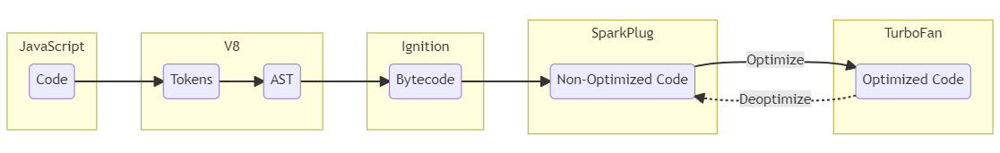
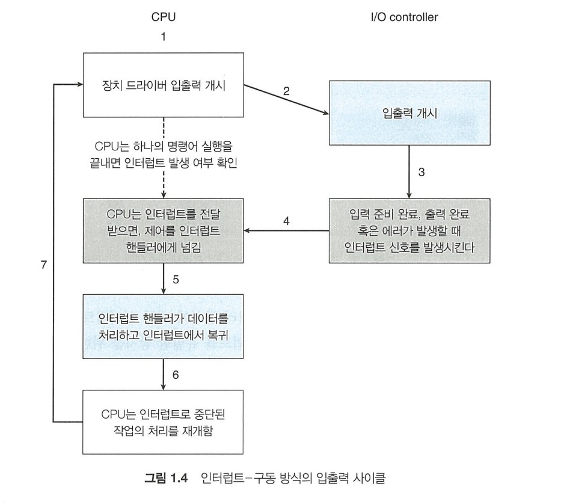
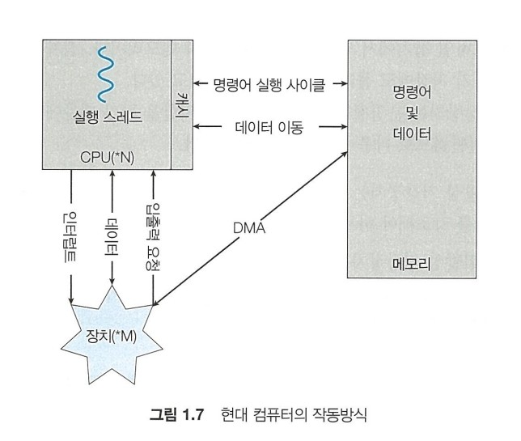
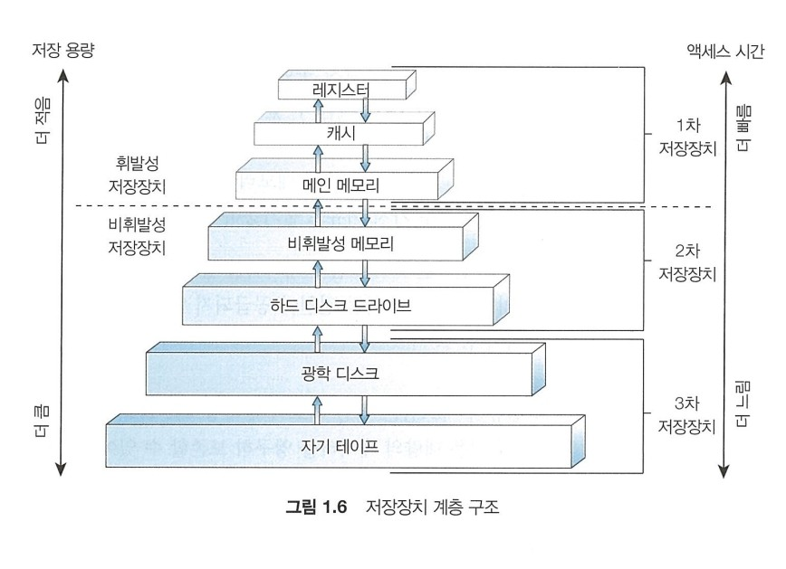

# 컴퓨터의 일반적인 구성

운영체제는 사용자에게는 자원의 이용을 신경쓰게 하지 않고 사용의 용이성을 위해 설계되었다. 그리고 하드웨어/소프트웨어 자원을 할당하고 입출력장치와 응용프로그램을 제어하는 제어프로그램의 역할을 한다.

운영체제에 들어가는 프로그램에 대한 정의는 없다. 항상 실행중인 커널, 응용 프로그램 개발을 쉽게 해주는 미들웨어 프레임워크(ex. 안드로이드 운영체제 내부의 ART 가상머신과 핵심 Java 라이브러리는 미들웨어로 분류된다. [출처](https://en.wikipedia.org/wiki/Middleware#cite_ref-12)), 시스템 관리에 도움이 되는 시스템 프로그램이 포함된다.

#### [ART가 뭐임?](https://www.charlezz.com/?p=42686)

ART는 안드로이드 런타임의 약자로 이전의 안드로이드 운영체제에서의 dex파일을 실행하는 런타임이다. 가장 큰 변경점으로는 이전에 사용하던 Dalvik에서 쓰이던 **JIT**형식을 버리고 **AOT** 컴파일 방식으로 바꾸었다는 점이 있다(요즘에는 혼용해서 사용하는 것으로 보인다).

#### [JIT와 AOT는 무슨 차이가 있을까?](https://www.cesarsotovalero.net/blog/aot-vs-jit-compilation-in-java.html)

보통 Java 어플리케이션은 컴파일 시에 중간 언어(IR, intermediate representation)인 bytecode 형태로 변환한 후 런타임에서 bytecode를 native code로 컴파일하여 수행하게 된다. 이 때 IR인 Java bytecode를 native code를 어떤 전략으로 컴파일하냐에 따라 JIT와 AOT로 나뉜다.

JIT는 Just In Time의 약자다. JIT 컴파일 전략을 따를 경우 런타임에 bytecode를 해석하여 실행 가능한 기계어로 변환한다. 런타임에 얻을 수 있는 추가정보와 함께 최소한의 최적화된 기계어를 생성해낼 수 있지만 느리다.

AOT는 Ahead Of Time의 약자다. AOT 컴파일 전략을 따를 경우 bytecode에서 최적화된 네이티브 이미지를 (실행되기 전에) 컴파일하여 만든다. 런타임에서 변환할 것이 없기 때문에 빠르지만 네이티브에 종속된다.

동적 언어인 JavaScript는 JIT 컴파일 방식과 함께 **Adaptive JIT Compilation** 전략도 사용했다.

#### [Adaptive JIT Compilation은 또 뭔데](https://meetup.nhncloud.com/posts/77)

JavaScript로 만들어진 프로그램은 보통 연산이 중요한 프로그램이 많지 않고 브라우저의 API과 통신하거나 사용자의 입력을 중시해서 만들어진다. 이는 자주 반복돼서 수행되는 구간(hotspot)이 적다고 볼 수 있다. 그러면 native code로 컴파일 하는 시간이 수행하는 시간보다 커지는 문제에 직면하여 hotspot이 적은 코드에 대해서는 컴파일 하는 것보다는 인터프리터로 코드를 처리하는 것이 빠르게 된다. 하지만 웹이 점점 발전하면서 hotspot이 큰 코드에도 대비해야 하는 상황에 이루어졌다.

Adaptive JIT Compilation은 반복적인 코드의 정도에 따라 유동적으로 최적화를 하는 것이다. 링크에서는 V8의 CrankShaft를 예시로 들었는데 현재 V8은 CrankShaft를 사용하지 않는다. 그래도 동작하는 방식은 비슷하다. 

 

> 출처: https://jhalon.github.io/chrome-browser-exploitation-1/

V8에서 AST로 바꾼 뒤 interpreter를 통해 bytecode로 바꾼 뒤 hotspot이 있는 경우 컴파일하고 아닌경우에는 bytecode로 바꿔서 실행하는 방식이고, 비슷한 방식으로 [다른 엔진도](https://www.youtube.com/watch?v=5nmpokoRaZI) 실행되고 있다.  

## 구성요소

현대의 범용 컴퓨터 시스템은 위의 그림과 같이 하나 이상의 CPU와 구성요소 그리고 공유 메모리 사이의 액세스를 제공하는 공통 버스를 통해 연결된 여러 장치 컨트롤러로 구성된다. 그리고 운영체제에는 장치 컨트롤러마다 장치 드라이버(커널의 일부임)가 있다.

장치 컨트롤러에서 장치 드라이버에게 데이터를 알리는 방식은 인터럽트를 통해 이루어진다.

### 인터럽트

인터럽트는 하드웨어나 소프트웨어에 의해 발생하며 하드웨어의 경우는 시스템 버스를 통해, 소프트웨어는 시스템 콜이라는 명령을 통해 인터럽트를 발생시킨다. 소프트웨어로 발생하는 인터럽트는 트랩이라고 불린다.

CPU가 인터럽트 신호를 받으면 하던 일을 멈추고 메모리의 고정된 위치를 찾는다. 이 위치는 인터럽트 벡터에 저장되어있다. 인터럽트 벡터는 인터럽트를 처리할 수 있는 서비스 루틴들의 주소를 가지고 있는 공간으로, 파일 읽기/쓰기와 같은 중요한 동작들이 하드코딩되어 있다.

위 다이어그램은 기본 인터럽트-구동 방식의 입출력 사이클을 요약한 것이고 장치 컨트롤러가 서비스 준비가 될 때와 같은 비동기 이벤트에 CPU가 대응할 수 있게 한다. 최신 운영체제에서는 위 사이클보다 정교한 인터럽트 처리 기능이 필요하다.

1. 중요한 처리중에는 인터럽트 처리 연기
2. 장치의 적절한 인터럽트 핸들러로 효율적으로 디스패치
3. 운영체제가 인터럽트 우선순위를 구분하고 적절한 긴급도로 대응하도록 다단계 인터럽트가 필요

위 기능들은 CPU 및 인터럽트 컨트롤러 하드웨어에 의해 제공된다. 인터럽트 컨트롤러가 따로 필요한 이유는 CPU가 제한된 인터럽트 요청 라인을 가지고 있기 때문이다. 대부분의 CPU에는 마스크 불가능 인터럽트 라인과 마스킹 가능 인터럽트 라인이 있다. 마스크 불가능 인터럽트는 복구할 수 없는 이벤트(ex. 하드웨어 오류)를 위해, 마스크 가능 인터럽트는 I/O장치에서 발생하는 서비스를 요청하기 위해 사용된다. 그리고 가장 긴급한 작업을 먼저 수행하기 위해 우선순위 레벨을 구현한다.

### 저장장치

범용 컴퓨터는 프로그램을 보통 메인 메모리(RAM, Random-Access Memory)에서 가져온다. RAM은 휘발성이기 때문에 부트스트랩 프로그램(전원을 켤 때 가장 먼저 실행되는 프로그램)을 담을 수 없다. 그래서 읽기 전용 메모리(EEPROM)이나 펌웨어(추가 소프트웨어/드라이버 없이 기기의 하드웨어에서 직접 실행된 소프트웨어, 부팅같은 기본 기능을 제어하는데 사용됨)를 사용한다.

현대 컴퓨터는 기본적으로 폰노이만 구조를 따른다. 폰 노이만 구조에서 실행되는 명령-실행 사이클은 메모리에서 명령을 인출해 명령 레지스터에 저장한다. 이후 명령을 해독하고 메모리에서 피연산자를 갖고 와서 처리한다. 그러므로 메모리에 있는 것이 명령인지 데이터인지 알지 못해서 프로그램에 의해 어떻게 생성되었는지 무시할 수 있다.

위 그림에서는 대량 데이터 이동에 인터럽트가 사용될 때 오버헤드가 발생할 수 있으므로 CPU를 거쳐서 메모리에 적재하는 것이 아닌 직접 메모리 액세스(DMA)하여 적재한다. 이 때 인터럽트는 한 바이트마다가 아닌 블록 전송이 완료할 때마다 발생한다. 

이상적으로는 메인메모리에 영구히 존재하면 좋겠지만 메인 메모리는 휘발성에 크기가 작기 때문에 다른 보조 저장장치를 제공한다.

##### [최대 절전모드는 어떻게 작동하는가](https://superuser.com/questions/1409139/how-does-computer-sleep-mode-works-how-ram-holds-information-even-if-power-is-c)

이전의 절전이라고 하면 고전적인 Suspend-to-RAM 절전모드을 가리키는 것이며 RAM이외의 모든 전원을 끄는 방식이다. 최대 절전모드라고 불리는 hibernation mode는 램의 내용을 모두 디스크에 저장하고 파워를 완전히 끈다. hybrid mode에서는 램의 내용을 모두 디스크에 저장하고 컴퓨터의 전원을 RAM을 제외하고 모두 끄는 방식이다. Windows는 hybrid sleep mode를 채용하고 있다고 한다(hybrid mode 끌 수 있다).

## 컴퓨터 시스템 구조

컴퓨터 시스템은 다양하다. 과거에는 단일 코어를 가진 CPU를 포함하는 단일 프로세서를 사용했다. 단일 프로세서를 사용한 컴퓨터 시스템은 단일 처리기 시스템(Single-Processor Systems)이라고 불린다. 하지만 이러한 단일 처리기 시스템은 현재에는 거의 사용되지 않는다.

### 다중 처리기 시스템

최신 컴퓨터에서는 다중 처리기 시스템(MultiProcessor System)이 많이 사용된다. 일반적인 다중 처리기 시스템에는 대칭형 다중 처리 구조(SMP, Symmetric MultiProcessing)를 활용하며 CPU(프로세서)가 여러 개 있는 시스템이라고 볼 수 있다. 각각 CPU에는 레지스터와 캐시가 있으며 모든 프로세서는 시스템 버스를 통해 메모리를 공유하는 방식이다.

다중 처리기는 시간에 지남에 따라 진화해왔으며 현재는 여러개의 코어가 단일 칩에 있는 다중 코어 시스템을 포함한다. 각 코어에는 **L1 캐시**와 자체 레지스터 세트가 있으며 **L2 캐시**는 모든 코어에서 공유하는 방식이다.

다중 처리기 시스템에서 CPU를 추가하면 컴퓨팅 성능이 향상되지만 시스템 버스에서 병목 현상이 발생한다. 그래서 각 CPU에 작고 빠른 로컬버스를 통해 로컬 메모리를 제공하는 방식을 사용한다. 이 구조를 NUMA(Non-Unniform Memory Access)라고 한다.

#### [L1, L2, 그리고 L3 캐시는 뭐임?](https://www.makeuseof.com/tag/what-is-cpu-cache/)

L1에서 L은 Level을 뜻하며 Level을 뜻하며 레벨이 올라갈 수록 싸고 용량이 크고 느리다. L1 캐시는 명령 캐시와 데이터 캐시로 나누어져 있으며 말 그대로 명령/데이터 정보를 유지한다. L2부터는 따로 나누어져 있지 않으며 요즘 CPU에서는 L2는 코어당, L3는 칩당 하나 존재하는 방식으로 만든다.

### 클러스터형 시스템

일반적인 정의의 클러스터형 시스템은 저장장치를 공유하고 근거리 통신망(LAN) 같은 고속의 상호 연결망으로 연결된 시스템을 의미한다. 클러스터 시스템은 여러 독립적인 시스템이 모여 하나의 시스템을 이루는 것이다. 이런 시스템을 약결합(loosely coupled)라고 부른다. 클러스터링 시스템은 보통 높은 가용성을 제공하기 위해 사용된다.

클러스터링은 비대칭적/대칭적 둘 다 구성될 수 있다. 비대칭형 클러스터링에서는 하나의 장비가 긴급 대기(hot-standby) 모드로 작동하며, 다른 노드를 모니터링만 한다. 대칭 클러스터링은 두개 이상의 노드가 작업을 수행하는 동시에 다른 노드들을 모니터링하는 구조이다.

## 운영체제의 작동

컴퓨터를 실행하려면 펌웨어에 저장된 부트스트랩 프로그램이 실행되며, 이는 시스템의 모든 측면을 초기화 하며 메인 메모리에 운영체제를 적재하기 위해 커널을 적재하여 실행한다. 커널이 실행되면 시스템과 사용자에게 서비스를 제공할 수 있는데, 이 때 프로그램이나 서비스에 특정 기능을 제공하기 위해 지속적으로 실행되는 백그라운드 프로세스/서비스인 시스템 데몬이 실행된다.

### 다중 프로그래밍과 다중 태스킹

다중 프로그래밍이라 불리는 Multiprogramming은 여러 실행중인 프로그램(프로세스라고 한다)을 동시에 메모리에 유지하여 항상 한개는 실행할 수 있도록 만드는 시스템이다. 이렇게 CPU의 사용률을 높인다.

다중 태스킹(Multi Tasking)은 CPU가 여러 프로세스를 전환하며 실행하여 빠른 응답시간을 제공하여 동시에 작동하는 것처럼 보이게 만드는 시스템이다.

### 이중모드와 다중모드

시스템을 올바르게 실행하기 위해서 운영체제의 코드 실행과 사용자 정의 코드 실행을 구분할 수 있어야 한다. 대부분의 컴퓨터 시스템에서는 하드웨어 자원을 제공함으로서 이를 해결한다. 하드웨어 측에서 사용자 모드와 커널 모드를 구분하는 모드 비트를 제공한다. 최신 프로세서들은 다중모드를 통해 가상화를 위한 모드를 지원하기도 한다. 사용자 모드에서 프로그램이 커널 모드에서만 수행할 수 있는 작업을 수행하도록 시스템 콜을 호출할 수 있다.

### 타이머

사용자 프로그램이 제어를 운영체제에게 넘기지 않았을 때를 대비해서 타이머를 사용하여 특정 주기에 인터럽트하여 제어를 가져온다. 타이머는 고정이거나 가변일 수 있다.

### 그 외에도 하는 일

운영체제는 자원을 관리하는 일도 한다.

- 프로그램이 메모리에 올라가 프로그램 카운터(PC)를 가진 프로세스를 관리한다
- 메모리의 어떤 부분이 어디에 쓰이는지, 누가 사용하는지 추적하고, 어떤 프로세스와 데이터가 메모리의 안팎으로 옮겨질지 결정한다.
- 여러 유형의 물리적 매체와 그것을 제어하는 장치를 관리함으로써 파일의 추상적 개념을 구현한다.
- 물리적 매체를 얻허게 관리하고 할당/분할/보호할 것인지를 관리한다.
- 캐시를 관리해서 컴퓨터의 처리 속도를 높인다.
- 입출력 장치를 장치 드라이버를 통해 관리한다.

### 보안과 보호

보호는 시스템이 정의한 자원에 프로그램/프로세서/사용자의 접근을 제어하는 기법이고 보안은 자원을 내부/외부의 공격을 방어하는 기능이다. 두 가지를 제공하기 위해서는 사용자 또는 그룹을 구분한다. 이를 위해 사용자나 그룹의 이름과 식별자 리스트를 유지한다.

### 가상화

하드웨어를 추상화하여 개별 환경이 컴퓨터에서 실행되고 있다고 느껴지게 만드는 기술이 가상화 기술이다. 가상머신을 실행하는 시스템인 호스트와 가상 머신 관리자(VMM, 하이퍼바이저라고도 함)이 인터페이스를 제공하여 게스트 프로세스에 호스트의 가상 복사본이 제공되어 실행된다.

