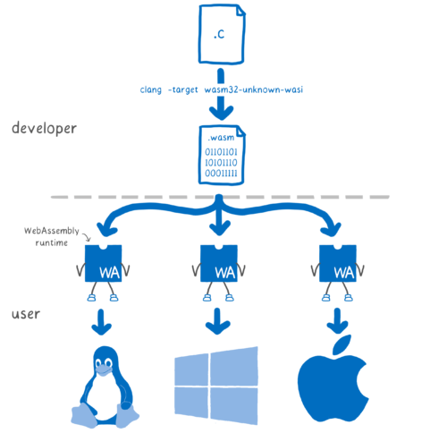

# 운영체제 구조

운영체제는 사용자와 시스템에 다양한 서비스를 제공한다.

사용자에게는 다음과 같은 서비스를 제공한다.

- 사용자 인터페이스(UI)
- 프로그램 수행 및 종료
- 입출력 연산
- 파일 시스템 조작
- 프로세스간 통신
- 오류 감지

시스템에게는 다음과 같은 서비스를 제공한다.

- 컴퓨터 자원의 효율적인 할당
- 기록 작성(로깅)
- 보호 및 보안

## 시스템 콜

시스템 콜은 운영체제를 통해 사용 가능한 서비스를 요청하는 프로그래밍 방식이다. 시스템 콜 인터페이스가 API 호출을 가로채서 시스템 콜의 구현의 메모리의 특정 주소 범위에 있는 시스템 콜 루틴을 실행하는 방식으로 수행된다. 시스템 콜 인터페이스는 보통 실행시간 환경이라 불리우는 RTE에 의해 관리된다.

과거 x86 리눅스에는 인터럽트를 호출한 뒤 인터럽트에서 시스템 콜을 호출하는 방식을 따랐는데, 펜티엄 2+ 이후 대체 [시스템 콜 매커니즘을 구현](https://articles.manugarg.com/systemcallinlinux2_6.html)했다고 한다. 그리고 CPU 구조에 따라 제공하는 API가 달라서 구현 방식도 다르다.

### 유형

- 프로세스 제어
- 파일 조작
- 장치 조작
- 정보 유지 보수
- 통신
- 보호 및 보안

### 매개변수 전달

시스템 콜에 필요한 매개변수를 전달하는 방법은 세가지가 있다.

1. 매개변수를 레지스터 내에 전달하는 방법
2. 매개변수를 메모리에 저장한 후 메모리의 주소를 전달하는 방법
3. 매개변수를 스택에 프로그램에 의해 넣고 운영체제가 꺼내는 방법

#### [WASI는 뭔가요?](https://hacks.mozilla.org/2019/03/standardizing-wasi-a-webassembly-system-interface/)

WASM이 웹에 한정된 것이 아닌 모든 인터페이스에서 동작할 수 있게 만드는 프로젝트이다. WASI는 WASM 하나의 코드로 많은 런타임에서 보안 측면에서 안전하게 실행할 수 있는 것을 목표로 한다. 시스템 콜을 하는데 액세스 권한을 안전하게 부여한다고 한다.

## 링커와 로더

소스파일이 컴파일되면 오브젝트 파일로 컴파일되는데, 링커는 오브젝트 파일을 모아 오브젝트 파일을 모아 실행파일로 결합하는데 사용되고 로더는 실행파일을 메인 메모리에 적재하는데 사용된다.

위에서는 링킹할 때 모든 라이브러리를 연결한다고 써있는데, 실제 시스템에서는 실행파일의 크기 축소와 업그레이드 용이성을 위해 실행할 때 라이브러리를 동적으로 연결한다. Windows는 DLL(Dynamic Linked Library)방식으로 지원한다. [출처](https://www.lesstif.com/software-architect/shared-library-linker-loader-12943542.html)

응용프로그램이 모두 다른 하드웨어 아키텍쳐에서 제대로 실행되기 위해서는 운영체제의 도움이 필요하다. 운영체제나 라이브러리에서는 이를 위해 API의 컴파일 된 버전인 ABI(Application Binary Interface)를 제공한다. 예를 들어 Nodejs나 Electron은 코드를 실행하기 위해 다른 ABI를 가지고 있다.

#### [Wine은 어떻게 작동하는가](https://sudormrf.run/2020/04/22/wine/)

Windows의 바이너리 파일인 PE(Portable Executable)형식을 실행시켜줄 Loader와 Linker를 구현하였고, Windows의 DLL파일을 직접 구현하여 PE를 실행할 수 있는 환경을 구현했다고 한다.

## 운영체제 구조

1.  모놀리식 구조
  - 구조가 없는 구조라고 볼 수 있다. 커널의 모든 기능을 한 곳에서 실행하는 방식이다.  오버헤드가 거의 없고 커널 속에서 통신속도가 빠르지만 확장 및 구현하기 어렵다.
2. 계층적 구조
  - 운영체제를 세분화하여 계층으로 나눈 구조이다. 자신의 층의 서비스와 기능만 구현하면 되어서 구현과 디버깅이 간단하지만 각 계층을 정의하기 어려운 단점이 존재한다.
3. 마이크로 커널
  - 최소한의 기능을 제공하는 가벼운 커널을 말한다. 서비스의 대부분이 사용자에게 맡겨져 있어 확장이 쉽고 이식이 쉽다.
4. 적재가능한 커널 모듈
  - 부팅 혹은 실행 중에 부가 서비스를 모듈을 통해서 링크하여 사용할 수 있다. 커널을 확장하기 위한 기술이다.

### WSL1은 어떻게 작동하는가

Pico 프로세스가 windows process와 격리되어 Windows NT 커널의  LxCore/Lxss에 넘겨져 시스템 콜을 제공한다.

#### [WSL2는 어떻게 동작하는가](https://roy-n-roy.nyan-co.page/Windows/WSL%EF%BC%86%E3%82%B3%E3%83%B3%E3%83%86%E3%83%8A/Architecture/#fn:8)

WSL2에서는 Hyper-V 반가상화를 통해 Linux 커널을 직접 실행하는 방식이다.