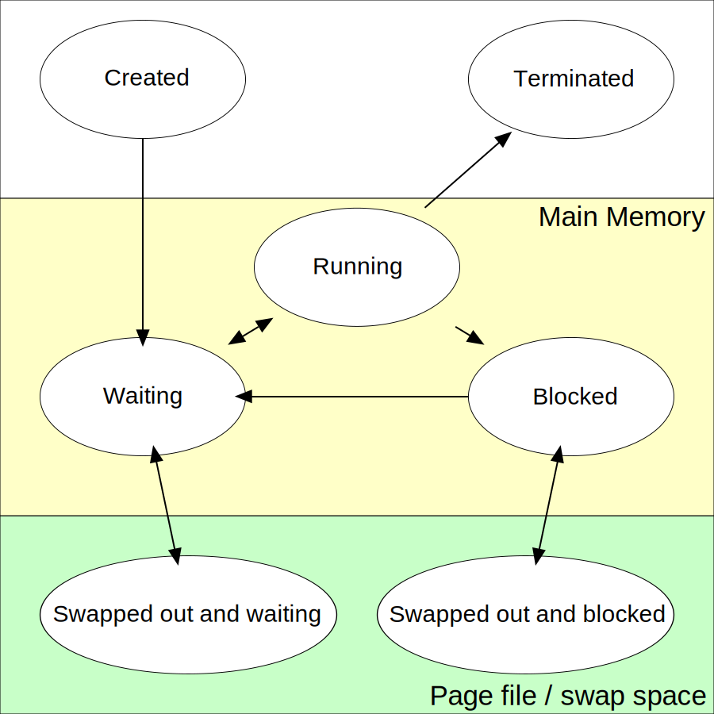
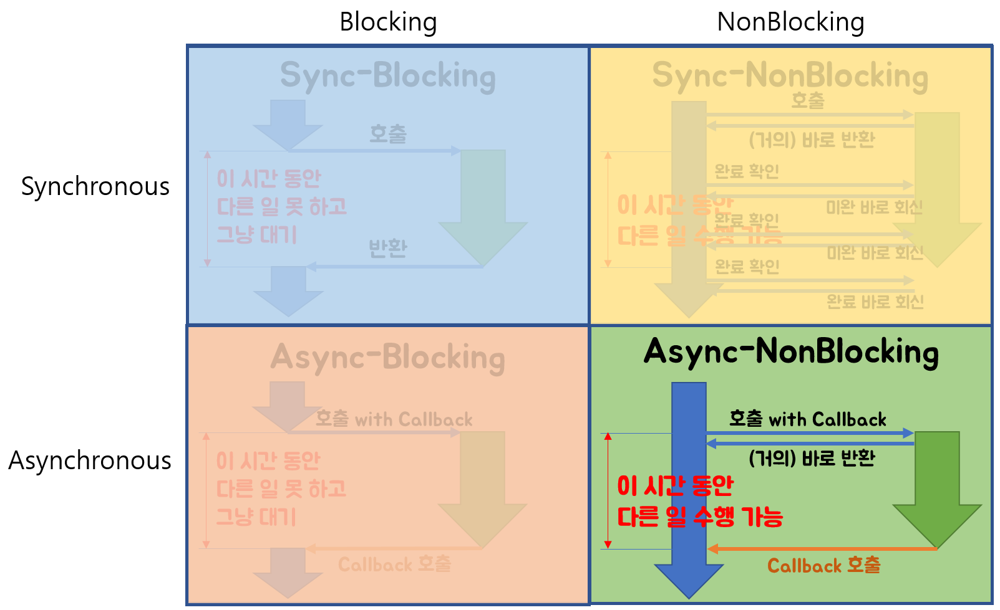

# 프로세스 관리

프로세스의 상태는 프로그램 카운터 값과 프로세서 레지스터의 내용으로 나타낸다. 메모리 배치는 [운영체제에 따라 다르지만](https://sudormrf.run/2020/04/22/linuxandwindows/) Stack 섹션과 Heap 섹션이 있다는 점을 알고 있으면 될 것 같다. 

함수가 호출될 때마다 지역 변수/복귀 주소를 포함하는 활성화 레코드가 스택에 푸시되고, 함수가 끝나면 활성화 레코드가 팝된다. 힙은 동적으로 할당될 때 커진다.

#### [V8의 메모리 관리](https://deepu.tech/memory-management-in-v8/)

Stack에서는 원시형 데이터와 지역변수(참조형일 경우 포인터)를 저장하고, Heap에서는 참조형 데이터를 저장한다. 

## 프로세스의 상태

가장 중요한 것은 waiting상태에서 스케줄링되면 running 상태로 가서 실행되고, interrrupt가 발생하면 다시 waiting으로 가고 입출력이나 이벤트를 기다리게 되면 Blocked(asleep)상태가 된다는 것이다.

### PCB

프로세스의 정보를 수록한다. 대표적으로 다음과 같은 정보가 있다.

- 프로세스 상태
- 프로그램 카운터(다음 명령어의 주소)
- CPU 레지스터와 상태정보
- CPU 스케줄링 정보
- 메모리 관리 정보
- I/O 정보
- 기타

### 스케줄링

프로세스가 준비 큐(ready queue, 보통 PCB를 저장하는 연결 리스트임)에 들어가면 ready 상태가 된다. 자식 프로세스 종료나 입출력 같은 이벤트를 기다리는 대기 큐(waiting queue, 역시 PCB를 저장하는 연결 리스트)도 존재한다.

### 문맥 교환(Context switching)

인터럽트가 발생하면 시스템이 인터럽트 처리 종료 후 기존의 프로세스를 다시 실행하기 위해서 기존 프로세스의 Context를 저장할 필요가 있다. Context는 PCB에 저장되며 복구할 때도 PCB에서 복원한다.

### Created

프로세스가 실행되는 동안 다른 프로세스를 생성할 수 있다. 이를 통해 기존 프로세스를 부모, 새로 만들어진 프로세스를 자식으로 보면 프로세스 트리가 만들어진다.

자식 프로세스를 만드는 방법은 두가지가 있다.

- 부모 프로세스를 복사하여 실행하며 부모 프로세스는 자식 프로세스가 실행이 끝날 때까지 기다린다(UNIX).
- 자식 프로세스가 새로운 프로그램을 통해 실행되고 부모 프로세스와 자식 프로세스는 병행하게 실행한다(Windows).

## IPC

프로세스간 자료를 공유해서 계산을 빠르게 하고 모듈화를 잘 할 수 있도록 협력적 프로세스들은 프로세스 간 통신(IPC)을 사용한다.

### 공유 메모리 시스템

특정 메모리 공간을 여러 프로세스가 공유하는 방식이다. 운영체제의 영향이 가지 않아 동기화가 빠르지만 프로세스가 동시에 동일한 위치에 쓰게 하지 말도록 만들어야 한다는 단점이 존재한다. 

### 메세지 전달 시스템

공유 메모리를 통해 동기화를 하지 않고 메세지를 주고 받아 동기화하는 방식이다. 메세지를 전달하는 방법은 여러가지가 있다. 직접 통신으로 전달하는 경우는 큐를 이용하지 않고 직접 전달하고, 간접 통신으로 전달하는 경우는 메세지 큐를 사용하여 전달한다.

[Electron또한 IPC를 사용한다.](https://www.electronjs.org/docs/latest/tutorial/ipc) 이벤트에 기초한 메세지 전달 시스템을 사용한다.

#### [Blocking/Non-Blocking, 동기/비동기의 차이](https://homoefficio.github.io/2017/02/19/Blocking-NonBlocking-Synchronous-Asynchronous/)

- `호출된 함수`가 자신이 할 일을 모두 마칠 때까지 제어권을 계속 가지고서 `호출한 함수`에게 바로 돌려주지 않으면 Block
- `호출된 함수`가 자신이 할 일을 채 마치지 않았더라도 바로 제어권을 건네주어(return) `호출한 함수`가 다른 일을 진행할 수 있도록 해주면 Non-block
- `호출된 함수`의 수행 결과 및 종료를 `호출한 함수`가(`호출된 함수`뿐 아니라 `호출한 함수`도 함께) 신경 쓰면 Synchronous
- `호출된 함수`의 수행 결과 및 종료를 `호출된 함수` 혼자 직접 신경 쓰고 처리한다면(as a callback fn.) Asynchronous

### 파이프

파이프는 IPC 기법 중 하나이다.

- 일반(익명) 파이프
  - 단방향 통신이다.
  - 한 쌍(부모-자식)의 프로세스가 통신할 수 있음
  - 통신하는 동안만 존재
- 지명(named) 파이프
  - 양방향 통신이다.
  - 여러 프로세스가 통신할 수 있음
  - 통신하는 이후 존재

### 소켓과 RPC

두 방식은 클라이언트-서버 환경에서 소통하는 방식이다.

소켓은 통신의 극점을 뜻하며 IP 주소와 포트 번호로 구별한다. 두 프로세스가 두 소켓을 가지고 통신한다.

RPC는 별도의 원격 제어를 위한 코딩 없이 다른 주소 공간에서 함수나 프로시저를 실행할 수 있게하는 프로세스 간 통신 기술이다.